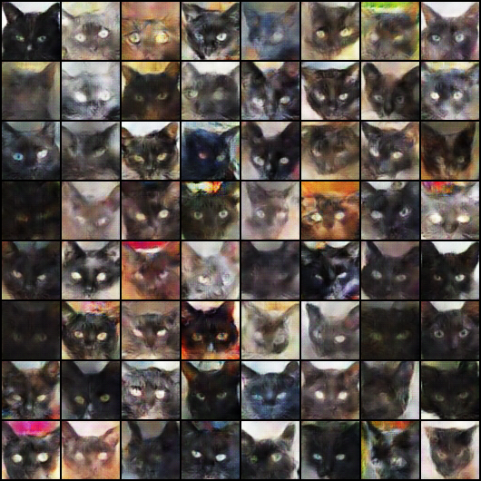
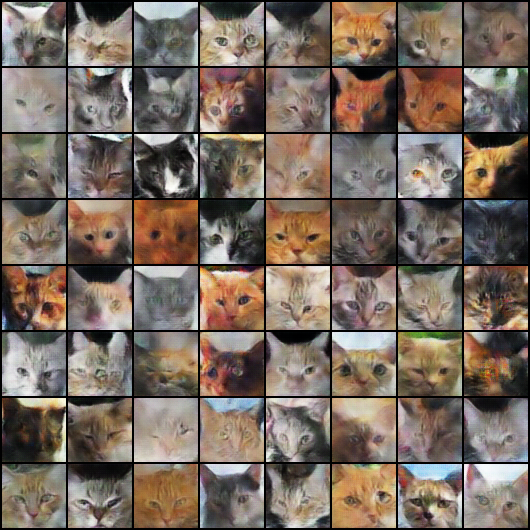
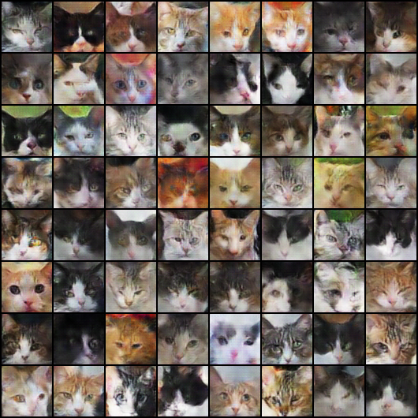
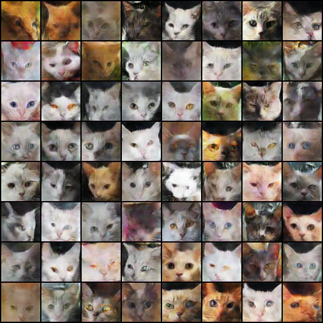

# Cat Conditional DCGAN

This is based on pytorch DCGan enhanced to be conditional. 

Untar hand crafted cat face images dataset/hand_crafted_aug.tar.gz

```
	tar xvf hand_crafted_aug.tar.gz

	#if using gpu
	python main.py --dataset=folder --dataroot=./dataset/hand_crafted_aug --nc=3 --cuda --ngpu=4 --niter=500 --cond

	#if using cpu
	python main.py --dataset=folder --dataroot=./dataset/hand_crafted_aug --nc=3 --niter=50 --cond

	#if using cpu mnist
	python main.py --dataset=mnist --dataroot=./mnist --nc=1 --niter=50 --cond

```

And to generate random images

```
	#for golden cats
	python generator.py --netG=./netG_epoch_6.pth --num_classes=4 --nc=3 --the_class=1

	#for mnist
	python generator.py --netG=./netG_epoch_6.pth --num_classes=10 --nc=1 --the_class=0
```

Black cats generated by conditional DCGAN. 



Golden cats generated by conditional DCGAN. 



Mixed cats generated by conditional DCGAN. 



White cats generated by conditional DCGAN. 

